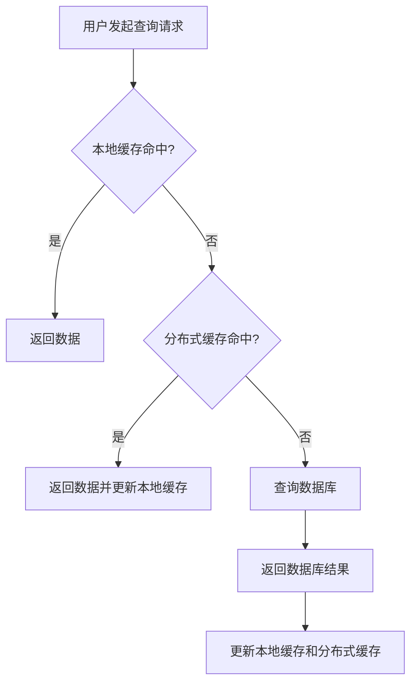

# 2025.5.13

初始化项目

# 2025.5.14

进行项目的前期工作。规范化。

抽象通用请求体。比如：删除数据请求， 分页查询请求。

抽象通用响应体。 编写BaseResponse类，封装响应体，包含：响应码， 数据， 消息， 描述。

构建全局异常处理器。

抽象通用业务异常类。

抽像通用错误响应码。

--------

# 第一阶段

完成用户管理以及图片管理模块。

* 阶段流程：
  1. 需求分析
  2. 方案设计
  3. 后端开发
  4. 前端开发

## 需求分析

1. 用户能够注册，登录，退出登录。
2. 用户能够修改个人信息
3. 用户具有管理员和普通用户这两个角色，不同角色具有不同权限。
4. 用户管理：仅管理员可用， 能够创建用户，修改用户，查询用户，搜索用户。
5. 获取当前登录用户

## 方案设计

* 库表设计

首先，用户表需要有 固定的五个字段（企业开发常见规范） ： id（用户标识）， editTime（用户编辑时间）, createTime（本条记录创建时间）, updateTime（本条记录更新时间，这个和editTime的区别是，即使是管理员直接修改数据库，这个时间也要更新）, isDelete（逻辑删除）。

然后是与用户体验相关的字段：用户昵称， 用户账号， 用户密码，用户头像，用户简介， 用户角色。

```sql
-- 用户表
create table if not exists user
(
    id           bigint auto_increment comment 'id' primary key,
    userAccount  varchar(256)                           not null comment '账号',
    userPassword varchar(512)                           not null comment '密码',
    userName     varchar(256)                           null comment '用户昵称',
    userAvatar   varchar(1024)                          null comment '用户头像',
    userProfile  varchar(512)                           null comment '用户简介',
    userRole     varchar(256) default 'user'            not null comment '用户角色：user/admin',
    editTime     datetime     default CURRENT_TIMESTAMP not null comment '编辑时间',
    createTime   datetime     default CURRENT_TIMESTAMP not null comment '创建时间',
    updateTime   datetime     default CURRENT_TIMESTAMP not null on update CURRENT_TIMESTAMP comment '更新时间',
    isDelete     tinyint      default 0                 not null comment '是否删除',
    UNIQUE KEY uk_userAccount (userAccount),
    INDEX idx_userName (userName)
    ) comment '用户' collate = utf8mb4_unicode_ci;
    
-- 用户账号添加了唯一索引， 用户昵称添加了普通索引，能够加速以名称为条件时的查询
```

* 流程设计

用户注册：

需要一个UserRegisterRequest请求封装类， 用于接收用户的输入参数，主要包含用户账户， 用户密码， 确认密码。

1. 接收到请用户注册请求封装类参数后，先校验其是否为空，若为空则抛出BusinessException异常。
2. 调用UserService服务，进行用户注册。
   1. 校验用户账户，用户密码是否符合要求。用户账户长度要在5-20之间，用户密码长度要在6-10之间，用户密码要和确认密码相同。
   2. 在userService服务中，先查询该用户账户是否存在，若不存在，则继续下一步；否则，抛出异常。
   3. 插入用户数据，返回插入结果。
3. 在Controller层，需要以BaseResponse<>的统一响应体形式返回结果给用户。

> **tip**:
>
> 由于后端使用Long类型来标识用户id，而前端接收时，会自动将id解析为number类型，number的是双精度浮点类型，其取值范围没有long类型大，所以，当我们的id由mybatis自己生成时，会导致long数值过大，前端解析时会出现精度溢出。
>
> 对于需要使用超大整数的场景，服务端一律使用String字符串类型返回，禁止使用Long类型。
>
> ```java
> package com.tlm.storecollab.config;
> 
> import com.fasterxml.jackson.databind.ObjectMapper;
> import com.fasterxml.jackson.databind.module.SimpleModule;
> import com.fasterxml.jackson.databind.ser.std.ToStringSerializer;
> import org.springframework.boot.jackson.JsonComponent;
> import org.springframework.context.annotation.Bean;
> import org.springframework.http.converter.json.Jackson2ObjectMapperBuilder;
> 
> /**
>  * Spring MVC Json 配置
>  */
> @JsonComponent
> public class JsonConfig {
> 
>     /**
>      * 添加 Long 转 json 精度丢失的配置
>      */
>     @Bean
>     public ObjectMapper jacksonObjectMapper(Jackson2ObjectMapperBuilder builder) {
>         ObjectMapper objectMapper = builder.createXmlMapper(false).build();
>         SimpleModule module = new SimpleModule();
>         module.addSerializer(Long.class, ToStringSerializer.instance);
>         module.addSerializer(Long.TYPE, ToStringSerializer.instance);
>         objectMapper.registerModule(module);
>         return objectMapper;
>     }
> }
> ```

用户登录：

需要一个UserLoginRequest请求封装类， 用于接收用户的输入参数，主要包含用户账户， 用户密码。使用Lombok注解为其生成get和set方法。

1. 接收到请用户登录请求封装类参数后，先校验其是否为空，若为空则抛出BusinessException异常。
2. 调用UserService服务，进行用户登录。
   1. 查询数据库，判断用户是否存在。不存在，抛出异常；若存在，继续下一步。
   2. 校验数据库中的密码和当前用户输入的密码加密后是否相等。如果相等，登录成功，将用户信息存入session中，否则，返回用户登录失败信息。
3. 返回用户登录结果信息。

获取当前登录用户：

首先需要要给LoginUserVO试图封装类，需要对User对象进行脱敏，屏蔽一些敏感字段。使用Lombok注解为其生成get，set方法，并添加serailversionId字段。

1. 从Session中获取当前用户的登录态。判断用户是否登录，如果获取不到，则表示用户未登录，抛出未登录异常。
2. 根据获取到的登录态，取出用户的id，从数据库中查询该用户，得到User对象。
3. 将得到的User对象通过BeanUtils工具进行属性复制到LoginUserVO类中并返回给Controller层。
4. 在Controller层返回LoginUserVO。

用户权限校验管理：**自定义注解进行权限校验**

利用AOP，对需要校验用户权限的方法，在执行方法前进行权限校验。

先定义好注解AuthCheck,里面包含一个mustRole属性，默认值为空，代表不需要任何权限。

再定义一个切面，在切面中再定义校验权限的切点。

所以，进行AOP切面编程，需要定义两个个东西：切面，切点。而由于使用注解来标识需要进行权限校验的方法，所以还需要定义注解。

1. 定义注解:

   ```java
   package com.tlm.storecollab.annotation;
   
   import java.lang.annotation.ElementType;
   import java.lang.annotation.Retention;
   import java.lang.annotation.RetentionPolicy;
   import java.lang.annotation.Target;
   
   @Target(ElementType.METHOD)
   @Retention(RetentionPolicy.RUNTIME)
   public @interface AuthCheck {
   
       String mustRole() default "";
   }
   
   ```

2. 定义切面和切点

   ```java
   @Aspect
   @Component
   public class AuthInterceptor {
   
       @Around("@annotation(authCheck)")
       public Object doIntercept(ProceedingJoinPoint joinPoint, AuthCheck authCheck) throws Throwable {
           String role = authCheck.mustRole();
           UserRoleEnum userRole = UserRoleEnum.getValueByValue(role);
   
           // 如果不需要权限，则直接执行
           if (userRole == null){
               return joinPoint.proceed();
           }
   
           // 获取当前用户所具有的权限
           RequestAttributes requestAttributes = RequestContextHolder.currentRequestAttributes();
           HttpServletRequest request = ((ServletRequestAttributes) requestAttributes).getRequest();
           Object attribute = request.getSession().getAttribute(UserConstant.USER_LOGIN_STATE);
           ThrowUtils.throwIf(ObjectUtil.isNull(attribute), ErrorCode.NOT_LOGIN);
           User loginUser = (User) attribute;
           String loginUserRole = loginUser.getUserRole();
           UserRoleEnum loginUserRoleEnum = UserRoleEnum.getValueByValue(loginUserRole);
   
           // 如果用户没有任何权限，则抛出异常
           ThrowUtils.throwIf(ObjectUtil.isNull(loginUserRoleEnum), ErrorCode.NO_AUTH);
   
           // 如果权限需要为 管理员 才能执行， 而用户又不是管理员
           if (UserRoleEnum.ADMIN.equals(userRole) && !UserRoleEnum.ADMIN.equals(loginUserRoleEnum)){
               throw new BusinessException(ErrorCode.NO_AUTH);
           }
   
           return joinPoint.proceed();
       }
   }
   
   ```

### 用户管理

用户管理功能具体可以拆分为:

* [管理员] 创建用户
* [管理员]根据id删除用户
* [管理员] 更新用户
* [管理员] 分页查询用户列表（需要脱敏）
* [管理员] 根据id获取用户（未脱敏）
* 根据id获取用户（脱敏）

对于mybatis分页查询：

于 `v3.5.9` 起，`PaginationInnerInterceptor` 已分离出来。如需使用，则需单独引入 `mybatis-plus-jsqlparser` 依赖 ， 具体请查看 [安装](https://baomidou.com/getting-started/install) 一章。


# 2025.05.15

# 图片模块

## 需求分析

管理员：

1. 上传和创建图片。（这里的理解：上传图片是指将图片存储到对象服务中，创建图片是指在数据库中创建一条图片记录）
2. 管理图片， 包括查询图片，修改图片，删除。
3. 能够根据图片属性进行分页查询。

普通用户：

1. 查看与搜索图片列表（主页）
2. 查看图片详情（详情页）
3. 图片下载

具体分析每个需求：

1. 上传和创建图片：仅管理员可用，支持选择本地图片上传，同时指定图片的相关信息，如名称，简介，标签，分类等。系统会自动解析图片的基础信息（如宽高和格式等），便于检索。
2. 图片管理：管理员可以对图库内的图片资源进行删除，修改，查询。
3. 查看搜索图片列表：用户在主页可以按关键字搜索图片，支持按分类、标签筛选条件分页查看图片列表。
4. 查看图片详情：点击某张图片后，可以进入详情页，查看图片的具体信息。
5. 图片下载：用户在详情页可以点击下载图片按钮，将图片保存到本地。

## 方案设计

* 库表设计 ： 主要是图片表， 需要有固定的五个字段(id, editTime, udpateTime, createTime, isDelete)。另外还有，url, name,introduction,category,tags,picSize,picWidth,picHeight,picScale,picFormat,userId。
  **哪些字段上需要加索引**：经常被作为条件查询，分组的字段，最好加上索引。

  ```java
  -- 图片表
  create table if not exists picture
  (
      id           bigint auto_increment comment 'id' primary key,
      url          varchar(512)                       not null comment '图片 url',
      name         varchar(128)                       not null comment '图片名称',
      introduction varchar(512)                       null comment '简介',
      category     varchar(64)                        null comment '分类',
      tags         varchar(512)                       null comment '标签（JSON 数组）',
      picSize      bigint                             null comment '图片体积',
      picWidth     int                                null comment '图片宽度',
      picHeight    int                                null comment '图片高度',
      picScale     double                             null comment '图片宽高比例',
      picFormat    varchar(32)                        null comment '图片格式',
      userId       bigint                             not null comment '创建用户 id',
      createTime   datetime default CURRENT_TIMESTAMP not null comment '创建时间',
      editTime     datetime default CURRENT_TIMESTAMP not null comment '编辑时间',
      updateTime   datetime default CURRENT_TIMESTAMP not null on update CURRENT_TIMESTAMP comment '更新时间',
      isDelete     tinyint  default 0                 not null comment '是否删除',
      INDEX idx_name (name),                 -- 提升基于图片名称的查询性能
      INDEX idx_introduction (introduction), -- 用于模糊搜索图片简介
      INDEX idx_category (category),         -- 提升基于分类的查询性能
      INDEX idx_tags (tags),                 -- 提升基于标签的查询性能
      INDEX idx_userId (userId)              -- 提升基于用户 ID 的查询性能
  ) comment '图片' collate = utf8mb4_unicode_ci;
  ```

* 如何存储图片？最简单的方法，将图片存储在本地服务器上。但是这种方法具有很多劣势。

  1. 不具扩展性。本地服务器存储容量有限，扩充麻烦。
  2. 不具安全性。本地服务器可能存在漏洞，恶意用户通过代码可能越权访问到隐私信息。
  3. 不具管理性。本地存储只能存储文件本身，没有提供额外的管理服务。腾讯云对象存储，还提供了数据万象等功能，能够分析数据。
  4. 不具可迁移性。当本地服务器需要迁移时，图片数据也需要跟着迁移，增加迁移成本。

* 存储图片业务流程。

  1. 传统方法，先上传再提交数据：用户在页面点击上传图片后，就会图片存储到云服务对象存储中并生成url，此时数据库中并不会生成一条记录。待用户填写其他信息并提交后，才会在数据库生成记录。
  2. 上传图片时就生成记录：用户上传图片时，直接在数据库生成记录。随后，用户填写其他信息，相当于更新数据库中已有的记录。

  方案1的特点是：流程简单。但是一旦用户上传文件后没有提交其他信息，文件就会残留在对象存储中，造成资源浪费。方案二的特点是：用户的操作和数据记录一致，能够溯源，还能够对用户上传图片做一些限制。

* 如何解析图片属性？
  根据需求，要获取的图片信息有：宽，高，宽高比，大小，格式，名称。
  主流获取图片属性的方式有两种：

  1. 后端直接处理图片。java库ImageIO,python库Pillow，OpenCV等。
  2. 通过第三方云存储服务或图像处理API直接提取图片元数据。

* 如何下载图片？
  下载图片有三种方式。
  
  1. 服务器从对象存储中下载图片到本地，用户从服务器上下载。
  2. 服务器从对象存储中获取流返回给前端，用户从流中读取数据。这种方法不需要服务器下载图片。
  3. 服务器生成临时密钥给前端，前端拿临时密钥去对象存储中下载。（企业常用，但繁琐）。


# 2025.05.18

# 用户传图

## 需求分析

* 支持用户自主上传图片和管理员审核图片功能
* 支持URL导入图片
* 支持批量抓取和创建图片

## 方案设计

* 管理员审核图片：

由于引入了审核，这意味着，图片具有了新的状态，需要为图片表添加新的字段用来表示它的审核状态。通常，对于审核类流程，需要添加四个字段:

> viewStatus: 当前审核状态
>
> viewTime: 审核时间
>
> viewer: 审核人id
>
> viewMessage: 审核理由（原因）

审核状态有： 待审核(reviewing), 审核通过(pass), 审核不通过(rejected)。

状态流转：业务流程中可能发生的状态转移

reviewing -> pass

reviewing -> rejected

pass -> rejected

rejected -> pass

* 用户自主上传图片： 这个功能可以复用前面管理员上传/创建图片的逻辑，只需要将权限开放给普通用户。

* 支持URL来导入图片

前面已经实现了用户上传图片的功能，其基本流程为：用户在页面点击上传文件后，从本地电脑中，选择要上传的图片。这个图片会传到服务器，并被服务器临时保存，然后经过图片校验后，传到对象存储服务中，服务器从对象存储服务的返回结果中，获取图片的相关属性信息。

现在需要支持用户传入图片URL导入图片。首先要面临的问题就是，服务器如何校验用户传入的URL是否合法以及这段URL所对应的网络内容是否合法。

校验用户输入的URL：1. 首先需要校验用户传入的URL是否符合URL的基本形式，比如https/http://开头，然后校验，这段URL背后所对应的内容是否合法。

### 获取URL所对应的网络资源属性

如何获取URL所对应的网络资源属性？需要使用到HTTP请求中的**Head**请求。

我们常见的HTTP请求有四种Get, Post, Put, Delete。除此以外，还有五种：Head, Options, Patch, trace, connect。

> 类似于 GET，但服务器只返回响应的头部，不返回实际数据。用于检查资源的元数据（例如，检查资源是否存在，查看响应的头部信息）。

通过head请求，获取网络资源的相关属性，进行校验，如果校验合法，可以使用hutool包中的下载网络文件包将该资源下载下来。

### 模板方法模式在文件上传场景的使用

分析用户上传图片和通过URL导入图片两个功能的流程，可以抽象出一个流程模板。

> 1. **用户给出输入源**(在上传图片场景，输入源是MultiPartFile，即表单文件传到服务器后的接收对象；在URL导入图片场景，输入源为URL路径)。
> 2. **校验输入源是否合法。**（校验合法主要需要获取到数据源的各项属性参数，在上传图片中，服务器可以从MultiPartFile中，直接获取；在URL导入图片场景中，则需要发送Head请求来获取，如果合法，再将URL网络资源下载到本地）
> 3. **将本地临时文件，通过第三方服务提供的SDK上传**到对象存储服务当中，获取返回结果（解析后的图片属性），将这些结果存储到数据库中。
> 4. **返回响应给用户**。

通过以上分析，可以发现，1， 2步骤，会根据不同的情况发生变化，而3,4步骤共用一套逻辑。所以可以使用**模板方法**，复用，3,4步骤，而在子类中重写1,2步骤。

### 模板方法模式和策略模式的区别

* 模板方法模式是对一套确定**流程**的抽象，这套流程中的某些步骤可能因为场景的不同有一些区别，但本质上是在做类似的事。

​		按照自己的理解：模板方法模式主要是抽象和复用。

* 策略模式是对同一个数据源采取不同的处理算法。不涉及到流程这一概念。

# 2025.05.20

# 批量抓取和创建图片

本功能只开放给管理员。

抓取图片首先需要确定**抓取源**。 

> 抓取源的选择：
>
> 图片素材网站？？？ 不建议。版权问题。
>
> 搜索引擎 √  数据来源广泛

确定抓取源后，需要找到抓取源提供图片信息的接口。在Bing搜索引擎中，通过下拉图片搜索页，会触发图片请求。找到那个请求，然后分析其接口URL，解析其响应结果（比如，如果返回结果为HTML页面，则可以解析其中img标签的src属性。

```java
https://cn.bing.com/images/async?q=%e4%b8%96%e7%95%8c%e6%97%85%e6%b8%b8%e8%83%9c%e5%9c%b0&first=105&count=35&cw=1177&ch=947&relp=35&apc=0&datsrc=I&layout=RowBased_Landscape&imgbf=DfCtqwgAAACQAQAAAAAAAAAAAAAFAAAAXWBtN%2bNfTNnF3AFZg0g4iUKAACHpcA1sClkoPRejQI66ALFw4hu3QdAAMJLInMBIiSgIgTwDSEckIQAAAAAAAA%3d%3d&mmasync=1&dgState=x*601_y*1348_h*185_c*2_i*105_r*25&IG=FBFD300F7EAF42999E63CBC6CEEB8CA4&SFX=4&iid=images.5615
```

这个接口返回的响应结果，在浏览器预览（浏览器F12调出开发者工具，点击“网络”，在对应的请求响应上选择“预览”），可以看到HTML的视觉效果。

上面的接口有很多查询参数，通过测试，可以找到一些必填参数。比如q标识查询关键字,count标识查询条数。

爬取网络数据，使用Json库。

* 方案设计

1. 管理员发起请求，指定查询关键字， 图片命名前缀，以及抓取条数。

2. 校验请求参数不为空

3. 查询关键字不能为空，图片命名前缀为空时，默认为关键字。抓取条数不能超过30条。
4. 利用Jsoup提取接口响应中所有的img标签的src属性，获取要下载的图片的url.
5. 复用根据url上传图片的代码。
6. 返回结果（成功抓取的图片条数)

# 图库优化一：查询优化

对于频繁被查询的数据，可以将其存储到缓存中，这样，就不会频繁访问数据库了。

### 哪些数据需要缓存

简单来说，“读多写少”的数据就需要缓存。具体来说:

1. 高频访问的数据。比如用户主页展示的固定数据，系统首页，热门内容推荐等。
2. 计算成本较高的数据。比如，复杂查询结果，大量数据的统计结果。
3. 允许短时间延迟的数据。比如，不需要实时更新的排行榜。

### 怎么将数据存到缓存中

* 分布式缓存： Redis

  分布式缓存是指将数据存储到**多台服务器**上，
  Redis是实现分布式缓存主流的方案。其有如下优点：

  * 高性能： 基于内存操作，访问速度极快。单节点Redis的读写QPS可达10w次每秒。
  * 数据结构丰富：支持存储字符串，列表，集合，z-set等。
  * 分布式支持：可以通过 Redis cluster构建高可用、高性能的分布式缓存，还提供哨兵集群机制提升可用性、提供分片集群机制提高可扩展性。

* 本地缓存: Caffiene
  本地缓存是指数据存储在本地机器的内存中。为什么不用java的map来直接作为本地缓存呢？缓存并不仅仅这是考虑存储，还要考虑淘汰策略（因为内存不是无限大），过期， 线程安全， 支持异步操作等问题。即使你知道如何实现，那也很麻烦。
  相较于分布式缓存， 本地缓存 速度更快，但是无法在多个服务器之间共享，而且不方便扩容。
  本地缓存的**应用场景:**

  * 数据访问量有限的小型数据
  * 不需要服务器之间共享数据的单机应用
  * 高频、低延迟的访问场景（如用户临时会话信息，短期热点数据)

💡 由于本地缓存不需要引入额外的中间件，成本更低。因此如果只是需要提高数据访问性能，优先考虑本地缓存而不是分布式缓存。

### 缓存设计

像Redis和Caffiene都是k/v存储系统。需要指定key 和 value。key是字符串类型， value可以是各种类型。但是一般，缓存对象，都会将该对象进行序列化后存储。

* key的设计
  key就是从缓存中获取value值的唯一标识，一般只需要保证唯一即可。但是，在分布式缓存场景下，由于Redis数据库成本较高，常常会出现多个项目共用一个Redis的情况，所以需要让key具有结构化的特征，以避免和其他项目发生冲突，导致缓存被覆盖。如果使用本地缓存，则key可以更加精简。
  常用的key结构如下: `项目ID: ModuleId: ${查询条件Key}`, 不同的团队可能有不同的规范，遵循团队规范即可。
  由于这里查询条件过多，所以可以使用md5对查询条件key进行压缩。
* value的序列化
  存储java对象，需要将该对象序列化。
  ①通常，会将其序列化为JSON字符串的形式进行存储，但这种方式会占用较多的存储空间，因为JSON格式会有许多“， 空格等分隔符。
  ②也可以将对象序列化为二进制数据，然后进行存储。
  在开发时，可以使用JSON序列化存储，这样存储到缓存中后，可以方便的识别存储的数据内容。上线时，可以将序列化策略变为二进制序列化，以追求更少的存储空间占用。
* 过期时间
  **必须设置缓存过期时间**。由于内存是有限且相对于磁盘较小的，所以缓存必须设置过期时间，避免占用过多的内存。根据实际业务场景和缓存空间的大小，数据一致性要求设置，合适即可。本系统中，由于查询条件较多，而且考虑到图片会持续更新，设置为5~60min即可。
  另外，需要考虑到，缓存的过期时间应该具有一定的随机性，即在一个时间范围内随机选取一个时间作为过期时间。如果过期时间都一样，那么可能存在某个时刻，大量缓存同时过期失效，这就会导致大量请求直接打到数据库上，导致数据库崩溃，这就是**缓存雪崩**。


# 多级缓存

联合使用本地缓存和分布式缓存可以获得较好的性能和不错的健壮性。

当用户发起查询请求时，先判断本地缓存中是否命中，如果命中，则直接返回数据；如果未命中，则进一步查询分布式缓存，判断是否命中，如果命中，则直接返回数据，并更新本地缓存；如果未命中，则查询数据库。最后返回数据库结果，并更新本地缓存和分布式缓存。



# 扩展
1、手动刷新缓存
在某些情况下，数据更新较为频繁，但自动刷新缓存机制可能存在延迟，可以通过手动刷新来解决。比如:
·提供一个刷新缓存的接口，仅管理员可调用。
·提供管理后台，支持管理员手动刷新指定缓存。
2、解决缓存常见问题
使用缓存时，一般要注意下面几个问题:
1)缓存击穿:某些 **热点数据** 在缓存过期后，大量请求直接打到数据库解决方案:设置热点数据的超长过期时间，或使用互斥锁(如 Redisson)控制缓存刷新。

2)缓存穿透:用户频繁请求不存在的数据，导致大量的请求直接触发数据库查询。解决方案:对无效查询结果也进行缓存(如设置空值缓存)，或者使用布隆过滤器。

3)缓存雪崩:大量缓存同时过期，导致请求打到数据库，系统崩溃。解决方案:设置不同缓存的过期时间，避免同时过期;或者使用多级缓存，减少对数据库的依赖。

《如何解决缓存中的常见问题》是一道经典的八股文，可以去刷题网站上学习。


# 2025-05-21

# 图库优化二： 上传优化

## 图片压缩

压缩图片意味着图片能够以更小的体积存储。进而可以降低带宽使用和流量消耗(因为后面用户访问的都是压缩后的图片)。大幅度降低成本的同时，提高图片的加载速度。

有哪些压缩图片的方法？

* 将图片格式转换为体积更小的格式，比如webp或其他现代格式。
* 对图片质量进行压缩
* 缩小图片尺寸

对于图像网站来说，最好不要影响图片的质量，因为用户不想看到自己存储的图片不清晰，因此使用第一种方式更为合适。

将图片压缩为什么格式？怎么对图片进行压缩？

> 图片的压缩格式：
>
> 1） webp: 由Google开发的现代图片格式，支持有损和无损压缩。相比传统格式：
>
> * 比PNG文件小约26%
> * 比JPEG文件小约25%~34%
> * 支持透明背景（Alpha通道）
> * 兼容性：大部分主流浏览器（如Chrome、Edge、FireFox等）均已支持WebP。
>
> 2） AVIF：基于AV1视频编码技术的图片格式，压缩率更高。
>
> * 比WebP的文件大小更小，画质更优。
> * 支持透明背景和高动态范围。（HDR）
>
> 虽然AVIF在性能上更优，但是兼容性不佳，为了确保用户能够正常打开文件，最好采用webp格式。

> 图片压缩方案：
>
> 1. 在本地利用图像处理库进行压缩
> 2. 利用第三方服务进行压缩。（https://cloud.tencent.com/document/product/460）

由于本项目的图片存储在第三方对象存储服务中，所以可以直接使用第三方服务商提供的接口来压缩图像。

[数据万象 图片处理机制介绍](https://cloud.tencent.com/document/product/460/18147)

## 拓展知识：文件秒传

文件秒传的本质是避免重复上传相同的文件。其实现方法为：对于第一次上传的文件，为其生成一个唯一标识（如MD5、SHA-256），当用户上传曾经上传过的文件时，会用当前正在上传的文件的唯一标识去数据库中比对，如果存在，则用户不需要重复传送文件，即可完成上传。

* 适用场景：在大型文件传输场景下非常重要，可以提高性能，节约带宽和存储资源。在网盘中常见，重复上传两个文件，第二次上传非常快。
* 在本项目中的使用限制
  * 本项目中，不适用文件秒传，因为一张图片大小有限，另外用户重复上传的可能性较小，秒传的优化效果有限。
  * 本项目使用腾讯云cos对象存储，只能通过唯一地址去取文件，无法完全自定义文件的存储结构，也不支持文件快捷方式的概念。这会导致秒传文件地址和源文件地址相同，可能导致隐私泄露等问题。（比如， A传送了img1，B也传送img1，B的img1复用了A的访问路径，在代码中，用户A上传的文件访问路径包含了A的id）。

## 扩展知识：分片上传和断点续传

对于大文件，还可以开启分片上传和断点续传，不需要自己开发，直接使用[对象存储的SDK](https://cloud.tencent.com/document/product/436/14112)就能完成。

>  分片上传的原理:
>
> 加入一个大文件有5MB，分片大小为1MB，那么该文件会被切分成5个块。客户端和服务端都会维持一个块计数。
>
> 如果客户端成功发送了一个块，则计数变为1/5， 服务端成功接收一个块，则块计数会变为1/5，直到完成所有块的接收。


# 图库优化三：图片加载优化

图片加载优化的目的是提升页面加载速度、减少带宽消耗，并改善用户体验。

优化技术：

> * 缩略图
> * 懒加载
> * CDN加速
> * 浏览器缓存

## 缩略图

问题：用户同时浏览许多图片时，直接加载原图，会造成流量浪费。

在查询图片列表时，并不需要查看到完整清晰的图像，可以展示缩略图，如果用户对某个图片感兴趣，进入详情页后展示完整图像。

解决方案：在上传图片时，同时生成一份小尺寸的缩略图。只有在用户进入详情页或下载时，才加载原图。

* 实现方案：
  * 本地图像处理类库
  * 第三方服务：腾讯云数据万象支持生成缩略图。

## 懒加载


## CDN加速


## 浏览器缓存


